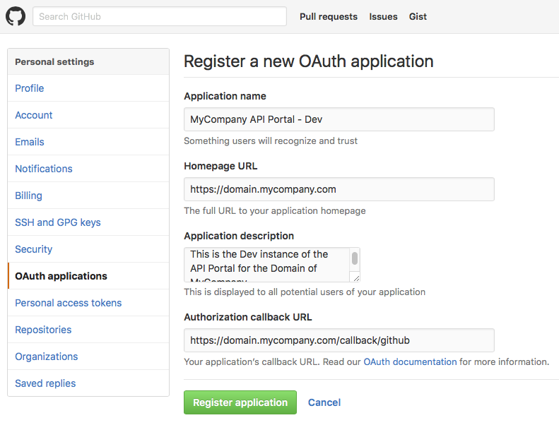
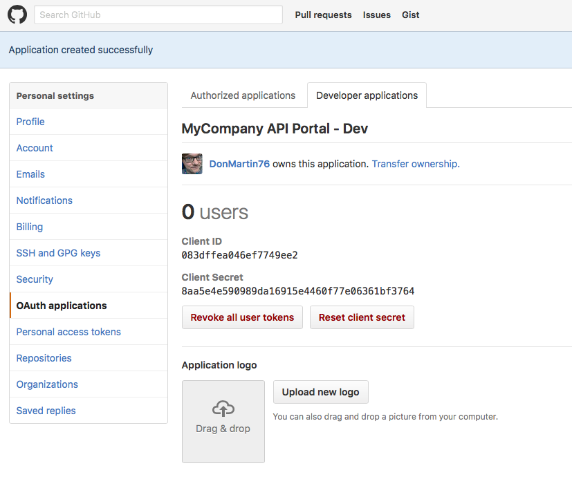
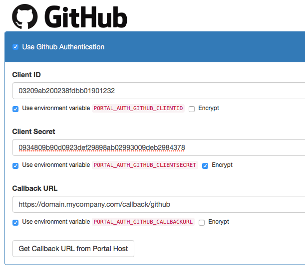

# Configuring Github Login

## Introduction

The API Portal can use Github for federating user logins to the API Portal. Users which are logged in using Github Social Login will automatically be registered for full use of the API Portal:

* The primary email address which is used with Github is taken as a verified email address in the API Portal automatically (the user is auto-verified)
* Name and email address are automatically retrieved from Github
* The ID from Github is used as a unique id (prepended with `GitHub:`) in the API Portal

This is probably a good fit for most public facing developer API Portals, as most developers tend to already have a GitHub account.

## Step 0: Prerequisites

You need the following things:

* A running [kickstarter](creating-a-portal-configuration.md), pointing to your configuration repository
* The fully qualified domain name (FQDN) of your API Portal(s)
* A valid GitHub account and access to the Account or Organization you want to create a login for

## Step 1: Register your API Portal(s)

Perform the following steps on [GitHub](https://github.com) to register your API Portal as a developer GitHub application:

* Open the Settings Tab, and open the [OAuth applications/Developer Applications](https://github.com/settings/developers) panel
* Click the "Register a new application" button
* Specify all needed fields:
    * **Application Name**: State a speaking name for your API Portal, e.g. "MyCompany API Portal DEV"
    * **Homepage URL**: This should point to the main page of your API Portal, e.g. `https://domain.mycompany.com`
    * **Application Description**: Write more information on the API Portal here; this will be displayed when Github users log in to the API Portal
    * **Authorization callback URL**: This is the most important bit, and has to point to the callback URL of your API Portal. If your main portal is at `https://domain.mycompany.com`, this will be `https://domain.mycompany.com/`**`callback/github`**

* Click "Register application"
* You will be presented the Client ID and Client Secret which are needed to configure your API Portal:

**Notes**:

* You will need separate GitHub applications for separate instances, e.g. for Dev, Test and Prod; each have a different set of credentials
* By registering a `localhost` callback URL, you can register a separate local testing application; this works just fine if you are in a developer setup
    * You could also register a DNS name you have specified in your `/etc/hosts` (or on Windows, `HOSTS` file) with GitHub. As OAuth 2.0 is a purely client side redirect flow, this will also work just fine, as long as your local browser is able to resolve the DNS name.
    * Combine this with a [`localhost` or `development` environment](deployment-environments.md) for most flexibility.

## Step 2: Configure the API Portal

Next, you need to configure the API Portal to know the GitHub credentials. To do that, open up the kickstarter on the [Authorization Page](http://localhost:3333/auth), and tick the "Use GitHub Authentication" check box:

Make sure you are using the "Use environment variable `....`" checkbox to enable:

* Having multiple Client IDs and Secrets for multiple environments
* Encrypting the Client ID (tick the "Encrypt" checkbox for this value) in the configuration repository

To learn more about deployment enviroments, see the [documentation on that](deployment-environments.md). 

Now all you have to do is to check in your changes to source control and redeploy your API Portal(s). GitHub social login should now be working.

## FAQ

* Nothing so far.