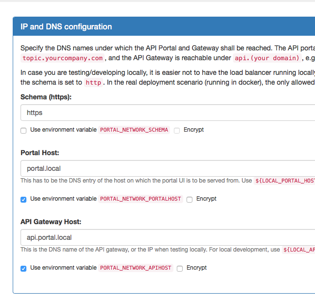

# Deploying an API Portal locally

In order to deploy an API portal locally on your development machine, you may follow these steps. These steps will hopefully lead to success, but be aware that there are alternate possibilities of deploying, specifically when you have multiple environments. This is not taken into consideration for this simplistic tutorial.

## Create a configuration

Make sure you have created a configuration repository and/or cloned the repository to your local machine. If you cloned it, place a `deploy.envkey` file in the `static` directory, containing the deployment key (`PORTAL_CONFIG_KEY`). This key was created the first time you created your repository; you should have kept it in a safe place (which is not git).

**See also**:

* [Creating a Portal Configuration](creating-a-portal-configuration.md)

Make sure a `portal-kickstarter` is running at [http://localhost:3333](http://localhost:3333) (described in detail in the above document):

```
$ cd /path/to/repository
$ docker run -it --rm -v `pwd`:/var/portal-api -p 3333:3333 haufelexware/wicked.portal-kickstarter
```

## Enable env vars for portal and API hosts

Enable using environment variables for the host names you want to deploy to. To do that, open up the [IP, DB and DNS page](http://localhost:3333/ipconfig) in the kickstarter. Click the two checkboxes depicting that:



Hit "Save" to save the configuration. Now you will be able to see that there are two new environment variables.

## Create a `localhost` environment

Within the kickstarter, go to the [Environments Page](http://localhost:3333/) and create a new Environment called `localhost`:


Open up that environment and override the two hosts environment variables we defined above:


Use the mentioned values:

* `portal.local` for the Portal host
* `api.portal.local` for the API host

## Create `/etc/hosts` entries

In case you haven't yet followed the ["Getting Started" instructions](http://wicked.haufe.io/gettingstarted.html), you will need to create local hosts entries for these new host names:

```
127.0.0.1   portal.local
127.0.0.1   api.portal.local
```

This has to added (most probably using `sudo`) to `/etc/hosts` on Mac OS X and Linux, or to `C:\Windows\System32\drivers\etc\hosts` on Windows. Make sure pinging these names work. 

## Create a `docker-compose.yml` file

Go to the [Deployment Page](http://localhost:3333/deploy) in the Kickstarter; if you don't have a `docker-compose.yml` in your base configuration directory, it will look like this:


Hit the "Save" button, and two files will be created:

* `docker-compose.yml`
* `static/Dockerfile`

Inside the `docker-compose.yml` file, the `static/Dockerfile` is referenced; see also the [deployment architecture](deployment-architecture.md) for a picture of how the containers work together. The `static/Dockerfile` is used to build the "Static Configuration Container".

## Create self-signed certificates

To test things, you will also need SSL certificates. The kickstarter can assist you in creating these at [localhost:3333/ssl](http://localhost:3333/ssl):


Hit the "Create Certificates" button; some files will be created in the `certs` directory underneath your base configuration repository. **Note**: This directory must never be checked in to source control, as the shell scripts contain the `PORTAL_CONFIG_KEY` which is used to deploy and manage the API Portal.

## Deploy your API Portal to your local `docker` host

Issue the following commands into a bash shell:

```
$ cd /path/to/repo # Change this to point to your configuration repo
$ pushd certs && source ./localhost.sh && popd # Set some environment vars
$ docker-compose up -d
```

After `docker-compose` has finished, you should be able to open your API Portal from [`https://portal.local`](https://portal.local).

To take down the API Portal again, issue the following command:

```
$ docker-compose down
```

Please note that this will also **delete all local data**, such as test applications you have registered, users names you have create and so on.
